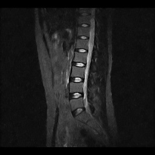
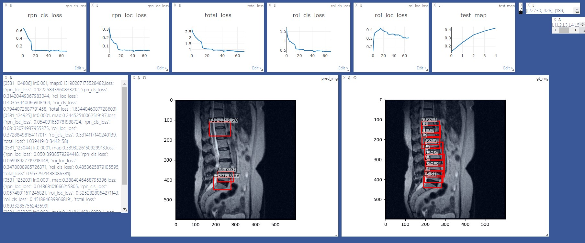

# Intelligent diagnosis of spine diseases

## Introduction

A project of Intelligent diagnosis of spine diseases with simple Faster-RCNN

The mid-term homework of the scoure Artificial Intelligence Comprehensive Experiment in ISE, SYSU.



**Tercher:** Liu Mengyuan

**Group Member:** Deng Yushan, Duan Yuxiao, Ding Yuhao, Deng Zhuotao, Yu Zhanpeng

2021/05/31


## Performance


### Speed

|   GPU                 | Inference | Trainining | GPU Memory |
| :------:              | :-------: | :--------: | :---------:|
|   GeForce RTX 2060    |   3 fps   |     3 fps  | 3 GB |


make sure you install cupy correctly and only one program run on the GPU. The training speed is sensitive to your gpu status. Morever it's slow in the start of the program -- it need time to warm up.

It could be faster by removing visualization, logging, averaging loss etc.

## Install dependencies


- install PyTorch with GPU (code are GPU-only), refer to [official website](http://pytorch.org)

- install other dependencies:  `pip install visdom scikit-image tqdm fire ipdb pprint matplotlib torchnet`

- command in cmd:
```Bash
python -m visdom.server
```

- start visdom for visualization, visit http://localhost:8097 in your browser and see the visualization of training procedure as below:




## Demo

Download pretrained model from [Google Drive](https://drive.google.com/file/d/18Q8NfYfuuYRosvv2wn-wK3oIica36dIH/view?usp=sharing) or [BaiduDisk](https://pan.baidu.com/s/1e8XqqUCXdvdkgo6089QJAQ) with password：gpci

See [Demo_pro.ipynb](https://github.com/IT-BillDeng/Intelligent-diagnosis-of-spine-diseases/blob/main/Demo_pro.ipynb) for more detail.

## Train

### Prepare data

#### SDL Dataset

1. Download the training, validation, test data [SDL](https://github.com/IT-BillDeng/Intelligent-diagnosis-of-spine-diseases/blob/main/dataset/SDL.zip)

   

2. Unzip it to the right address


### begin training

you may refer to `utils/config.py` for more argument.

Some Key arguments:


- `--plot-every=n`: visualize prediction, loss etc every `n` batches.
- `--env`: visdom env for visualization
- `--SDL_data_dir`: where the SDL data stored
- `--use-drop`: use dropout in RoI head, default False
- `--use-Adam`: use Adam instead of SGD, default SGD. (You need set a very low `lr` for Adam)
- `--load-path`: pretrained model path, default `None`, if it's specified, it would be loaded.

you may open browser, visit `http://<localhost>:8097` and see the visualization of training procedure.

## Acknowledgement
This work builds on many excellent works, which include:

- [Chenyun's simple-faster-rcnn-pytorch](https://github.com/chenyuntc/simple-faster-rcnn-pytorch)(mainly)
- [Yusuke Niitani's ChainerCV](https://github.com/chainer/chainercv) 
- [Ruotian Luo's pytorch-faster-rcnn](https://github.com/ruotianluo/pytorch-faster-rcnn) which based on [Xinlei Chen's tf-faster-rcnn](https://github.com/endernewton/tf-faster-rcnn)
- [faster-rcnn.pytorch by Jianwei Yang and Jiasen Lu](https://github.com/jwyang/faster-rcnn.pytorch).It mainly refer to [longcw's faster_rcnn_pytorch](https://github.com/longcw/faster_rcnn_pytorch)
- All the above Repositories have referred to [py-faster-rcnn by Ross Girshick and Sean Bell](https://github.com/rbgirshick/py-faster-rcnn)  either directly or indirectly. 

